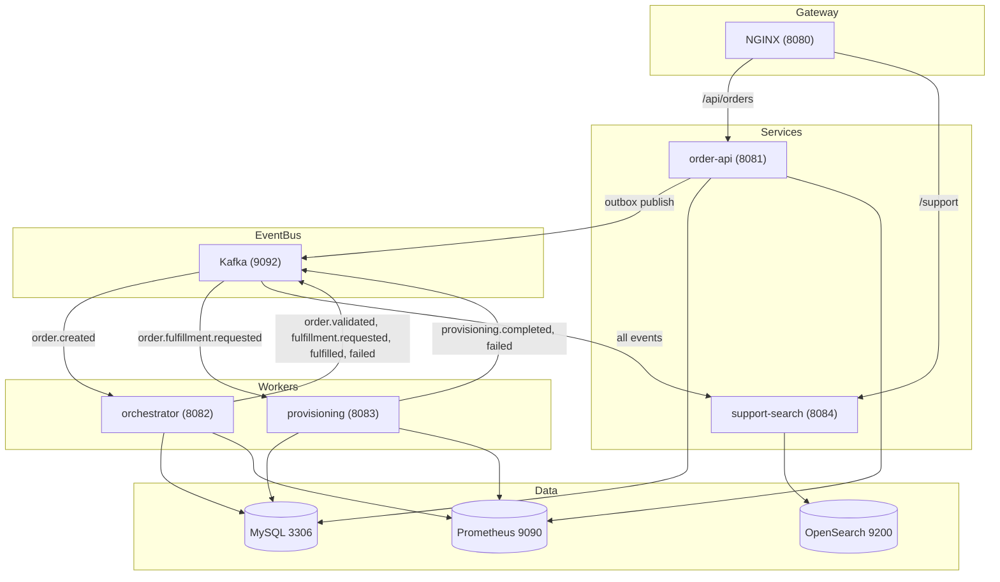

# Telecom Order Orchestration + Event Streaming Platform

A production-style portfolio project demonstrating event-driven architecture for telecom order processing (SIM activation, plan change, number port-in) with Kafka, observability, and RBAC.

## Architecture



## Kafka Topics

| Topic | Producer | Consumer | Description |
|-------|----------|----------|-------------|
| order.created | order-api (outbox) | orchestrator-service | New order created |
| order.validated | orchestrator | support-search | Order validated |
| order.fulfillment.requested | orchestrator | provisioning-service | Request provisioning |
| provisioning.completed | provisioning | orchestrator | Provisioning success |
| provisioning.failed | provisioning | orchestrator | Provisioning failure |
| order.fulfilled | orchestrator | order-api, support-search | Order complete |
| order.failed | orchestrator | support-search | Order failed |

Retry/DLQ: `{topic}.retry`, `{topic}.dlq` (exponential backoff documented in runbook).

## Quick Start

### 1. Start Infrastructure

```bash
docker-compose up -d mysql zookeeper kafka opensearch prometheus grafana jaeger
```

Wait ~30s for MySQL/Kafka/OpenSearch to be ready.

### 2. Run Services (in separate terminals)

```bash
# Terminal 1 - Order API
mvn -pl order-api spring-boot:run -Dspring-boot.run.profiles=dev

# Terminal 2 - Orchestrator
mvn -pl orchestrator-service spring-boot:run

# Terminal 3 - Provisioning
mvn -pl provisioning-service spring-boot:run

# Terminal 4 - Support Search
mvn -pl support-search-service spring-boot:run
```

### 3. (Optional) NGINX Gateway

```bash
docker-compose up -d nginx
# Routes: http://localhost:8080/api/orders -> order-api, /support -> support-search
```

## cURL Examples

### Create Order (idempotent)

```bash
curl -X POST http://localhost:8081/api/orders \
  -H "Content-Type: application/json" \
  -H "X-Customer-Id: cust-001" \
  -H "Idempotency-Key: key-$(uuidgen)" \
  -d '{"orderType":"SIM_ACTIVATION","msisdn":"+15551234567"}'
```

### Get Order

```bash
curl http://localhost:8081/api/orders/{orderId} \
  -H "X-Customer-Id: cust-001"
```

### Get Orders by Customer

```bash
curl "http://localhost:8081/api/orders?customerId=cust-001" \
  -H "X-Customer-Id: cust-001"
```

### Support Search (requires ROLE_AGENT/ADMIN; dev mode: permitAll)

```bash
curl "http://localhost:8084/support/search?q=cust-001"
curl "http://localhost:8084/support/orders/{orderId}/timeline"
```

### Simulate Provisioning Failure

Set in `provisioning-service/application.yml` or override:

```yaml
app:
  provisioning:
    simulate-failure: true   # or simulate-timeout, simulate-5xx
```

Restart provisioning-service. Create an order; it will fail and emit `order.failed`.

## Observability

- **Prometheus**: http://localhost:9090
- **Grafana**: http://localhost:3000 (admin/admin)
- **Jaeger**: http://localhost:16686

Metrics: `orders_created_total`, `orchestrator_orders_failed_total`, `provisioning_duration_seconds`, `http_server_requests_*`

## Runbook

### Debug Consumer Lag

1. Check Kafka consumer groups: `docker exec telecom-kafka kafka-consumer-groups --bootstrap-server localhost:9092 --list`
2. Describe lag: `kafka-consumer-groups --bootstrap-server localhost:9092 --group orchestrator-service --describe`
3. If lag high: scale consumers or fix processing errors; check DLQ for dead messages

### Debug DLQ

1. Consume from DLQ: `kafka-console-consumer --bootstrap-server localhost:9092 --topic order.created.dlq`
2. Inspect message payload and error; fix root cause; replay from DLQ to main topic if needed

### Provisioning Failures

1. Check `provisioning_attempts` table for error_message
2. Verify `app.provisioning.simulate-*` is false in production
3. Check MockCarrierApiClient logs for timeout/5xx simulation

### High P95 Latency

1. Grafana: provisioning_duration_seconds p95
2. Check OpenSearch/Jaeger for slow queries
3. Consider batch processing or async patterns

## Database Indexes (Flyway)

- `orders(customer_id)` – customer lookup
- `orders(msisdn)` – number lookup
- `order_status_history(order_id, created_at)` – timeline queries
- `outbox_events(status, created_at)` – publisher job
- `idempotency_keys` – primary key on idempotency_key

## What to Show in Interview

1. **Event-driven saga**: Order created → validated → fulfillment requested → provisioning → fulfilled/failed
2. **Transactional outbox**: Order + outbox row in same transaction; publisher job sends to Kafka
3. **Idempotency**: POST /api/orders with Idempotency-Key returns same response for duplicates
4. **Consumer idempotency**: `processed_events` table prevents duplicate handling
5. **Observability**: Structured logs, Prometheus metrics, correlation IDs
6. **RBAC**: ROLE_CUSTOMER (own orders), ROLE_AGENT (support), ROLE_ADMIN (all)
7. **Dev mode**: X-Customer-Id header for local testing without OIDC

## Tech Stack

- Java 21, Spring Boot 3.2.x
- Maven multi-module
- MySQL 8, Flyway
- Apache Kafka
- OpenSearch
- Spring Security (OIDC-ready, dev mode for local)
- Prometheus, Grafana, Jaeger

## License

MIT
